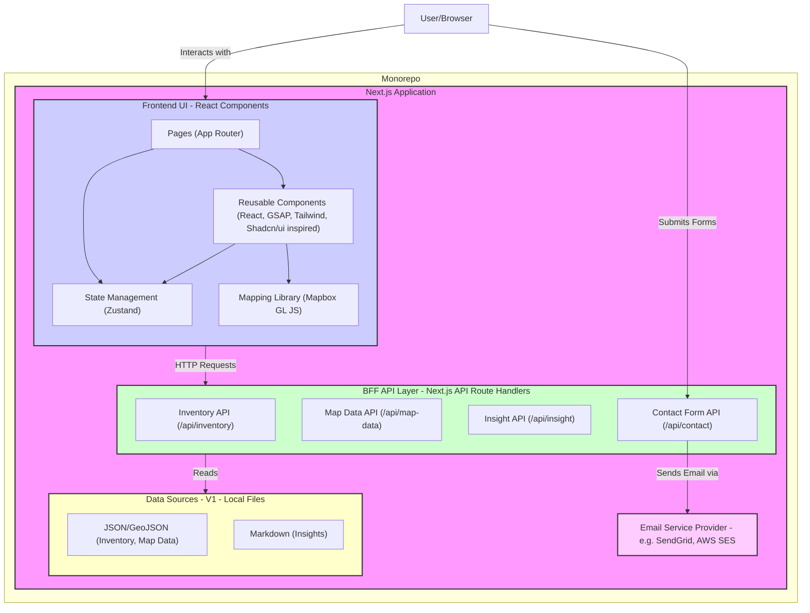
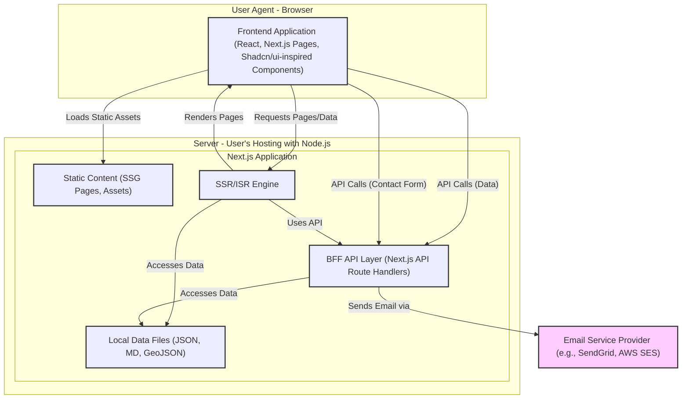
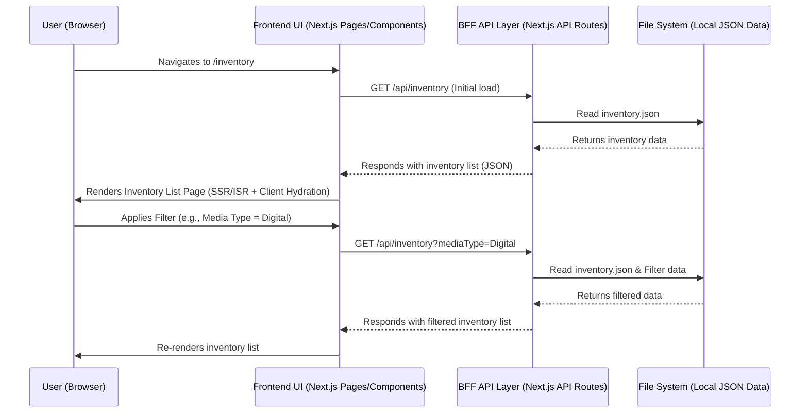
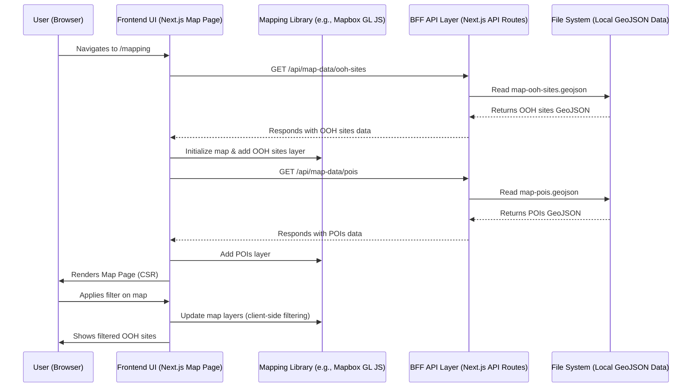
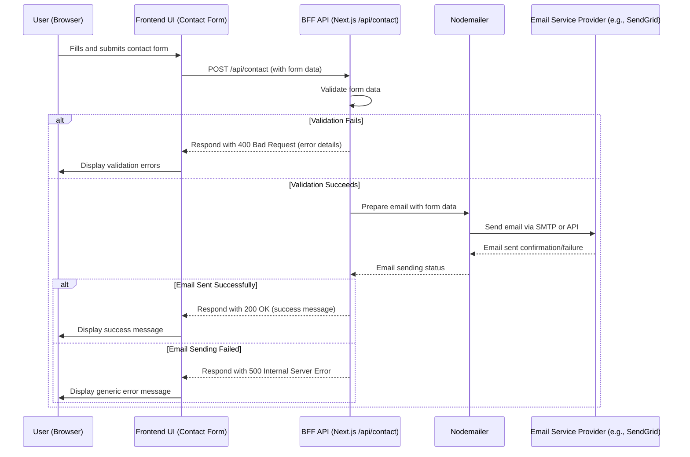

**CAESAR OOH MEDIA Website Modernization Architecture Document**

**Version: 0.4**
**Date: May 17, 2025** (Updated based on PO feedback)

**Table of Contents**

  * Technical Summary
  * High-Level Overview
  * Component View
      * Architectural / Design Patterns Adopted
  * API Reference
      * Internal APIs Provided (Next.js Route Handlers)
          * Inventory API
          * Map Data API
          * Insights API
          * Contact Form API (Self-hosted via Next.js API Route & Nodemailer)
  * Data Models
      * Core Application Entities / Domain Objects
          * OOHInventoryItem
          * PointOfInterest (POI)
          * InsightArticle
      * API Payload Schemas (If distinct)
          * ContactFormPayload
      * Database Schemas (If applicable)
      * State File Schemas (V1 Data Sources)
          * Inventory Data (`inventory.json`)
          * OOH Sites GeoJSON (`map-ooh-sites.geojson`)
          * Points of Interest GeoJSON (`map-pois.geojson`)
          * Insight Article Markdown (e.g., `src/content/insights/my-article.md`)
  * Core Workflow / Sequence Diagrams
      * User Browse Inventory Marketplace
      * User Interacting with Advanced Map Page
      * Contact Form Submission (Self-Hosted)
  * Definitive Tech Stack Selections
  * Infrastructure and Deployment Overview
      * Dependency Management & Special Requirements
      * Considerations for Paid Services and Scaling
  * Error Handling Strategy
  * Environment Vars Templates
      * Configuration Loading Mechanism
      * Required Variables
      * Env Var Notes
  * Security Best Practices
  * Testing Strategy
      * Overall Philosophy & Goals
      * Testing Levels
          * Unit Testing
          * Component Testing
          * Integration Testing (UI and API)
          * End-to-End (E2E) Testing
      * Specialized Testing Types
          * Visual Regression Testing
          * Performance Testing
          * Accessibility Testing
      * Test Data Management
  * Implementation Guidance
      * Development Environment
  * Key Reference Documents
  * Change Log
  * Design Architect Prompt (UI Considerations)

-----

**Technical Summary**

The CAESAR OOH MEDIA Website Modernization project aims to develop a cutting-edge, highly interactive, and user-centric website, replacing the previous WordPress solution. The architecture is centered around a Monorepo utilizing Next.js (v14+ with TypeScript and the App Router) as the primary framework, delivering a rich frontend experience with React (v18+), styled by Tailwind CSS (v4.x), and enhanced with GSAP (GreenSock Animation Platform) for sophisticated animations. This system will employ a hybrid rendering strategy (SSG, SSR/ISR, CSR) to optimize performance and SEO. Key components include an advanced Mapping page with POI integration (evaluating Mapbox GL JS), a detailed OOH Inventory Marketplace, and robust Dark/Light mode functionality. Backend capabilities will primarily leverage Next.js API Routes acting as a Backend-For-Frontend (BFF), initially serving data from local flat files (JSON/GeoJSON for V1 inventory, map data, and Markdown for insights) and handling tasks like contact form submissions via Nodemailer. An architectural evaluation is planned for a potential transition to a simple DBaaS (e.g., PostgreSQL with PostGIS) for improved scalability and data management. The architecture prioritizes clean, modular code following a Shadcn/ui-inspired philosophy for building reusable components documented in Storybook, a comprehensive testing strategy, and a performant, secure, and scalable solution aligned with the PRD's goal of establishing a strong, technologically advanced digital presence for CAESAR OOH MEDIA.

-----

**High-Level Overview**

The system is designed as a Monolithic Next.js Application housed within a Monorepo. This single Next.js application serves both the frontend user interface and the backend API functionalities (via API Route Handlers) acting as a Backend-For-Frontend (BFF). This simplifies development and deployment for V1.

The primary user interaction flow involves users navigating various informational pages (Homepage, About Us, Solutions), exploring industry insights, and engaging with two core interactive features:

1.  Advanced Mapping Page: Users can visually explore OOH inventory on an interactive map, filter sites, and view nearby Points of Interest (POIs).
2.  Inventory Marketplace: Users can browse, filter, sort, and view detailed listings of OOH media assets.

Data for V1 will be primarily sourced from local structured files (JSON, GeoJSON, Markdown). The Next.js application will utilize a hybrid rendering approach:

  * Static Site Generation (SSG): For largely static content like "About Us," "Solutions."
  * Server-Side Rendering (SSR) / Incremental Static Regeneration (ISR): For dynamic content that benefits from SEO and needs to be relatively up-to-date, such as "Insight" listings/articles and "Inventory" listings/details.
  * Client-Side Rendering (CSR): For highly interactive elements, particularly the "Mapping" page, advanced filters, and dynamic UI updates within already-rendered pages.

<!-- end list -->



-----

**Component View**

The system is primarily one major component: the Next.js Application. However, for clarity, we can logically divide it into:

1.  **Frontend Application (Client-Side & Server-Side Rendered UI):**

      * **Responsibilities:** Rendering all user-facing pages and components, handling user interactions, managing client-side state, and making requests to the BFF API layer for dynamic data. UI components will be built with a Shadcn/ui-inspired philosophy: creating custom, composable, accessible components from scratch (or unstyled primitives), styled with Tailwind CSS, and developed/documented in Storybook.
      * **Key Modules/Directories (within `src/`):**
          * `app/`: Contains page definitions, layouts, and API route handlers (acting as the BFF).
          * `components/`: Houses all reusable React UI components (layout, maps, inventory, insight, common, animations). This is the primary target for Storybook development.
          * `store/`: Zustand stores for client-side state management (UI state, map state, etc.).
          * `hooks/`: Custom React hooks for reusable logic.
          * `lib/`: Utility functions, GSAP setup, mapping library setup.
          * `services/`: Client-side services for interacting with the BFF API layer.
          * `styles/`: Global styles and Tailwind CSS configuration.
          * `types/`: TypeScript type definitions.
          * `content/`: Local data files for V1 (Markdown, JSON, GeoJSON).

2.  **Backend-For-Frontend (BFF) API Layer (Next.js Route Handlers):**

      * **Responsibilities:** Handling API requests from the frontend, fetching/processing data from V1 data sources (local files), structuring data for frontend consumption, and handling server-side logic like sending emails for contact form submissions.
      * **Location:** Resides within the `src/app/api/` directory of the Next.js application.

<!-- end list -->



**Architectural / Design Patterns Adopted**

  * Monorepo: Single repository for simplified dependency management and streamlined build/deployment processes for V1.
  * Next.js Framework (App Router Paradigm): Leveraged for its comprehensive features including file-system routing, hybrid rendering (SSR, SSG, ISR, CSR), Server Components, Client Components, image optimization, and TypeScript support.
  * React Component-Based Architecture: UI built with reusable React components, promoting modularity and maintainability.
  * Shadcn/ui Inspired Component Build (with Storybook): Focus on creating custom, composable, accessible components from scratch (or unstyled primitives like Radix UI), styled using Tailwind CSS, and developed/documented in Storybook. This provides maximum control and avoids dependency on large, opinionated UI libraries.
  * Tailwind CSS (Utility-First CSS): For rapid UI development, responsive design, and implementing dark/light themes.
  * GSAP (GreenSock Animation Platform): For high-performance, sophisticated UI animations and interactions (e.g., vertical twin scrolling).
  * Zustand (State Management): Lightweight, hook-based state management for global and complex local UI state.
  * Backend-For-Frontend (BFF) via Next.js Route Handlers: API routes within the Next.js app tailored specifically for the frontend's data needs, abstracting direct data source interactions and handling tasks like email sending.
  * Hybrid Rendering Strategy: Strategic use of SSG, SSR, ISR, and CSR to balance performance, SEO, and interactivity.
  * Modular Design (Services, Hooks, Components): Code organized into distinct modules for better separation of concerns and reusability.
  * Facade Pattern: API service modules (`src/services/`) act as facades, simplifying interactions with the BFF API Layer.

-----

**API Reference**

**Internal APIs Provided (Next.js Route Handlers)**

These APIs are part of the Next.js application, located under `src/app/api/`.

**Inventory API**

  * Purpose: To provide OOH inventory data to the frontend for the marketplace listing and detail pages.
  * Base URL(s): `/api/inventory`
  * Authentication/Authorization: None for V1 (public data).
  * Endpoints:
      * `GET /api/inventory`:
          * Description: Retrieves a list of OOH inventory items. Supports filtering and sorting via query parameters.
          * Request Parameters (Query): e.g., `mediaType`, `location`, `size`, `sortBy`, `sortOrder`.
          * Success Response Schema (Code: `200 OK`): Array of `OOHInventoryItem` objects.
      * `GET /api/inventory/{item-id}`:
          * Description: Retrieves details for a specific OOH inventory item by its ID.
          * Request Parameters (Path): `item-id` (string).
          * Success Response Schema (Code: `200 OK`): Single `OOHInventoryItem` object.
          * Error Response Schema (Code: `404 Not Found`): `{ "error": "Inventory item not found" }`

**Map Data API**

  * Purpose: To provide geographical data for OOH sites and Points of Interest (POIs) for the Mapping page.
  * Base URL(s): `/api/map-data`
  * Authentication/Authorization: None for V1.
  * Endpoints:
      * `GET /api/map-data/ooh-sites`:
          * Description: Retrieves OOH site locations as GeoJSON.
          * Success Response Schema (Code: `200 OK`): GeoJSON FeatureCollection of OOH sites.
      * `GET /api/map-data/pois`:
          * Description: Retrieves POI locations as GeoJSON. Supports filtering by category.
          * Request Parameters (Query): `category` (optional string).
          * Success Response Schema (Code: `200 OK`): GeoJSON FeatureCollection of POIs.

**Insights API**

  * Purpose: To provide insight articles to the frontend.
  * Base URL(s): `/api/insight`
  * Authentication/Authorization: None for V1.
  * Endpoints:
      * `GET /api/insight`:
          * Description: Retrieves a list of insight article summaries (metadata).
          * Success Response Schema (Code: `200 OK`): Array of `InsightArticle` metadata.
      * `GET /api/insight/{article-slug}`:
          * Description: Retrieves the full content of a specific insight article.
          * Request Parameters (Path): `article-slug` (string).
          * Success Response Schema (Code: `200 OK`): Single `InsightArticle` object with full content.
          * Error Response Schema (Code: `404 Not Found`): `{ "error": "Insight article not found" }`

**Contact Form API (Self-hosted via Next.js API Route & Nodemailer)**

  * Purpose: To handle contact form submissions by sending an email to CAESAR OOH MEDIA.
  * Base URL(s): `/api/contact` (example, can be customized)
  * Authentication/Authorization: None directly for the endpoint, but relies on secure email sending configuration.
  * Endpoints:
      * `POST /api/contact`:
          * Description: Receives contact form data from the client, validates it, and uses Nodemailer to send an email via a configured email service (e.g., SMTP, SendGrid, AWS SES).
          * Request Body Schema: `ContactFormPayload` (see Data Models section). Example:

<!-- end list -->

```json
{
  "name": "Jane Doe",
  "email": "jane.doe@example.com",
  "subject": "Question about services",
  "message": "I'd like to learn more about your billboard options."
}
```

```
    * Success Response Schema (Code: `200 OK`):
```

```json
{ "success": true, "message": "Your message has been sent successfully!" }
```

```
    * Error Response Schema (Code: `400 Bad Request` for validation errors, `500 Internal Server Error` for email sending failures):
```

```json
// Example 400
{ "success": false, "error": "Invalid form data", "details": { "email": "Please provide a valid email address." } }
// Example 500
{ "success": false, "error": "Failed to send message. Please try again later." }
```

-----

**Data Models**

**Core Application Entities / Domain Objects**

**OOHInventoryItem**

  * Description: Represents a single Out-of-Home advertising inventory item.
  * Schema / Interface Definition:

<!-- end list -->

```typescript
export interface OOHInventoryItemLocation {
  address: string;
  city: string;
  district?: string;
  latitude: number;
  longitude: number;
  mapLink?: string;
}

export interface OOHInventoryItemSize {
  width: number;
  height: number;
  unit: 'meters' | 'feet' | 'pixels';
}

export interface OOHInventoryItemSpecifications {
  material?: string;
  resolution?: string;
  illuminationDetails?: string;
  operatingHours?: string;
  trafficData?: string;
  facing?: string;
  mediaFormat?: string;
}

export interface OOHInventoryItem {
  id: string;
  name: string;
  location: OOHInventoryItemLocation;
  mediaType: string;
  size: OOHInventoryItemSize;
  illumination: 'Yes' | 'No' | 'Conditional';
  priceRange?: string;
  availabilityStatus: 'Available' | 'Booked' | 'Pending' | 'Maintenance';
  primaryImage: string;
  galleryImages?: string[];
  specifications: OOHInventoryItemSpecifications;
  description: string;
  uniqueSellingPoints?: string[];
  nearbyPOIs?: string[];
  availabilityCalendarLink?: string;
  downloadableSpecSheet?: string;
  videoCapability?: boolean;
  threeSixtyImageURL?: string;
  tags?: string[];
}
```

**PointOfInterest (POI)**

  * Description: Represents a Point of Interest relevant to OOH site locations.
  * Schema / Interface Definition (GeoJSON Feature):

<!-- end list -->

```typescript
export interface POIGeometry {
  type: 'Point';
  coordinates: [number, number]; // [longitude, latitude]
}

export interface POIProperties {
  id: string;
  name: string;
  category: string; // e.g., "Retail", "Transport Hub", "Public Space"
  description?: string;
  icon?: string;
}

export interface PointOfInterest { // This is a GeoJSON Feature
  type: 'Feature';
  geometry: POIGeometry;
  properties: POIProperties;
}

export interface POIFeatureCollection {
    type: 'FeatureCollection';
    features: PointOfInterest[];
}
```

**InsightArticle**

  * Description: Represents an article in the "Insight" section.
  * Schema / Interface Definition:

<!-- end list -->

```typescript
export interface InsightArticle {
  slug: string;
  title: string;
  date: string; // ISO 8601 (YYYY-MM-DD)
  author?: string;
  summary: string;
  image?: string;
  tags?: string[];
  content: string; // Markdown content
}
```

**API Payload Schemas (If distinct)**

**ContactFormPayload**

  * Description: Schema for the data submitted via the contact form.
  * Schema / Interface Definition:

<!-- end list -->

```typescript
export interface ContactFormPayload {
  name: string;
  email: string;
  subject?: string;
  message: string;
  oohInventoryId?: string;
}
```

**Database Schemas (If applicable)**

For V1, a formal database is not planned; data is sourced from flat files. This section will be relevant if/when a database (e.g., PostgreSQL with PostGIS) is introduced.

Evaluation for V1 (Flat Files vs. Simple DBaaS):

  * Decision for V1: Proceed with local flat files (JSON, GeoJSON, Markdown). The API layer (`src/app/api/`) will abstract data retrieval, making a future transition to a database smoother. Complex spatial queries (POI within radius) will be simplified for V1 (e.g., basic bounding box or pre-calculation if feasible with flat files, acknowledging technical debt here).

**State File Schemas (V1 Data Sources)**

**Inventory Data (`inventory.json`)**

  * Purpose: Stores the list of OOH inventory items.
  * Format: JSON array of `OOHInventoryItem` objects. (Schema detailed in Core Application Entities: OOHInventoryItem)

**OOH Sites GeoJSON (`map-ooh-sites.geojson`)**

  * Purpose: Stores geographical locations and basic properties of OOH sites.
  * Format: GeoJSON `FeatureCollection`. Each `Feature` has `Point` geometry and properties like `id`, `name`, `mediaType`, `status`.

**Points of Interest GeoJSON (`map-pois.geojson`)**

  * Purpose: Stores geographical locations and properties of POIs.
  * Format: GeoJSON `FeatureCollection` of `PointOfInterest` features. (Schema detailed in Core Application Entities: PointOfInterest)

**Insight Article Markdown (e.g., `src/content/insights/my-article.md`)**

  * Purpose: Stores content for individual insight articles.
  * Format: Markdown with YAML Frontmatter.
  * Schema Definition (Frontmatter):

<!-- end list -->

```yaml
---
slug: 'unique-article-slug' # Required, URL-friendly
title: 'Article Title' # Required
date: 'YYYY-MM-DD' # Required
author: 'Author Name' # Optional
summary: 'A short summary of the article for list views and meta descriptions.' # Required
image: '/images/insights/cover-image.jpg' # Optional, path to cover image
tags: ['tag1', 'tag2'] # Optional
---

# Article Title (can be repeated here or just use frontmatter title)

Full article content in Markdown format...
Supports standard Markdown syntax, including images, lists, etc.
```

-----

**Core Workflow / Sequence Diagrams**

**User Browse Inventory Marketplace**



**User Interacting with Advanced Map Page**



**Contact Form Submission (Self-Hosted)**



-----

**Definitive Tech Stack Selections**

Preferred Starter Template Frontend: New Next.js project with TypeScript (`create-next-app --typescript`).
Preferred Starter Template Backend: N/A (Backend is part of Next.js project).
Primary Language(s) & Version(s): TypeScript 5.x.
Primary Runtime(s) & Version(s): Node.js 20.x or higher.

```markdown
| Category             | Technology                        | Version / Details             | Description / Purpose                                       | Justification (Optional)                                                                 |
| :------------------- | :-------------------------------- | :---------------------------- | :---------------------------------------------------------- | :--------------------------------------------------------------------------------------- |
| **Languages** | TypeScript                        | ~5.3.x (latest stable)        | Primary language for Next.js app (frontend & BFF)           | Type safety, improved maintainability, better tooling.                                   |
| **Runtime** | Node.js                           | ^20.0.0 (LTS)                 | Server-side execution environment for Next.js               | Required by Next.js.                                                                     |
| **Frameworks** | Next.js                           | ^14.0.0 (App Router)          | Full-stack React framework                                  | Hybrid rendering, routing, image optimization, API routes.                               |
|                      | React                             | ^18.2.0                       | Frontend UI library                                         | Core of Next.js.                                                                         |
| **Styling** | Tailwind CSS                      | ^4.0.0-alpha (or latest stable) | Utility-first CSS framework                               | Rapid UI development, responsive design, dark mode.                                      |
| **Animations** | GSAP (GreenSock Animation Platform) | Latest stable                 | JavaScript animation library                                | Sophisticated, performant animations. Review licensing for commercial use.              |
| **Mapping** | Mapbox GL JS                      | Latest stable                 | Interactive map rendering                                   | Recommended. *Alternatives: MapLibre GL JS, Leaflet.* Potentially paid at scale.           |
| **State Management** | Zustand                           | Latest stable                 | Frontend state management                                   | Lightweight, simple, scalable.                                                           |
| **Databases (V1)** | Flat Files (JSON, GeoJSON, MD)    | N/A                           | Initial data storage                                        | Simplicity for V1. *Evaluate DBaaS for future.* |
| **Contact Form** | Nodemailer                        | Latest stable                 | Library to send emails from Node.js (for contact form)      | Enables self-hosted contact form submission.                                             |
|                      | Email Service Provider (e.g., SendGrid, AWS SES, Resend) | N/A            | For sending emails via Nodemailer                           | Required if self-hosting contact form. Free tiers often available.                      |
| **Cloud Platform** | User's Existing Hosting           | User Provided                 | Hosting for the Next.js application                         | Constraint. Must support Node.js or advanced static hosting. Potentially paid.           |
| **UI Primitives** | Radix UI (or similar headless)    | Latest stable                 | Unstyled, accessible UI primitives                          | Foundation for Shadcn/ui-inspired custom components.                                     |
| **Testing** | Jest                              | Latest stable                 | Unit/Component/Integration testing framework                | Widely used for React.                                                                   |
|                      | React Testing Library             | Latest stable                 | Testing React components                                    | User-centric testing.                                                                    |
|                      | Playwright                        | Latest stable                 | End-to-end testing framework                                | Modern, cross-browser.                                                                   |
| **CI/CD** | GitHub Actions (Recommended)      | N/A                           | Continuous Integration/Deployment                           | Automation. Free/paid tiers.                                                             |
| **Other Tools** | ESLint, Prettier                  | Latest stable                 | Code linting & formatting                                   | Code quality and consistency.                                                            |
|                      | Storybook                         | Latest stable                 | UI component development & documentation                    | Isolated development, visual testing. Potentially paid for advanced hosting/features.    |
```

-----

**Infrastructure and Deployment Overview**

  * Cloud Provider(s): User's existing hosting provider. Must support Node.js (e.g., v20.x+) or advanced static hosting with serverless functions.
  * Core Services Used: Dependent on hosting. If Vercel/Netlify: Build services, CDN, Serverless Functions. If self-hosting: Node.js server, reverse proxy.
  * Infrastructure as Code (IaC): Not planned for V1 if using managed hosting.
  * Deployment Strategy:
      * CI/CD Pipeline: Automated builds, tests, and deployments triggered by Git pushes to specific branches (e.g., `main` for production, `develop` or feature branches for staging/preview).
      * Tools: GitHub Actions is recommended if using GitHub. GitLab CI, Bitbucket Pipelines, or the hosting provider's built-in CI/CD (e.g., Vercel, Netlify) are also suitable.
      * Pipeline Steps (Conceptual):
        1.  Checkout code.
        2.  Setup Node.js and install dependencies.
        3.  Run linters and formatters.
        4.  Run unit and component tests.
        5.  Run E2E tests (against a preview deployment if possible).
        6.  Build Next.js application (`next build`).
        7.  Deploy to the target environment.
      * Rollback Strategy: Rollbacks will be managed via the hosting platform's deployment history (e.g., Vercel, Netlify typically allow instant rollbacks to previous successful deployments). For manually managed or self-hosted environments, rollbacks would involve redeploying a previously tagged stable Git commit/tag.
  * Environments: Local Development (`next dev`), Staging/Preview (automated by Vercel/Netlify or custom setup), Production.

**Dependency Management & Special Requirements**

  * Dependencies will be managed via `package.json` (npm or yarn).
  * Any dependency conflicts or special installation requirements discovered during development should be documented promptly (e.g., in the project's `README.md` or a dedicated `TROUBLESHOOTING.md`) to ensure smooth onboarding for all developers and consistent build environments. This includes noting specific versions if newer ones cause issues, or if certain dependencies require particular environment setups.

**Considerations for Paid Services and Scaling**

While V1 aims to leverage free tiers and existing infrastructure where possible, the following services are critical and *may* incur costs, especially as the application scales or if specific features beyond free tier limits are required:

1.  Hosting: The user's existing hosting is the primary factor. If it's insufficient for a Next.js application with potential SSR/API route needs and expected traffic, upgrading or migrating to platforms like Vercel, Netlify, or cloud VMs (AWS, GCP, Azure) will have associated costs (many offer free tiers initially).
2.  Mapping Services (e.g., Mapbox GL JS): Mapbox provides a generous free tier for map loads and API requests. High traffic to the mapping page will likely exceed these limits, leading to usage-based costs. Open-source alternatives like MapLibre GL JS still require tile providers, which can also have costs at scale (e.g., MapTiler, Stadia Maps).
3.  Email Sending (for self-hosted contact form): If using Nodemailer, an email service provider (like SendGrid, AWS SES, Mailgun, Resend) is needed. Most offer free tiers (e.g., 100 emails/day or thousands/month) which might be sufficient. Exceeding these limits incurs costs.
4.  Database (Post-V1 / Scaled V1): If flat files become unmanageable, migrating to a DBaaS (Vercel Postgres, Supabase, Neon for PostgreSQL; MongoDB Atlas for NoSQL) will involve costs beyond their initial free tiers, based on storage, compute, and traffic.
5.  GSAP Business License: While GSAP's core is free for most uses, including typical commercial websites, a "Business Green" membership might be required for access to premium plugins or specific commercial redistribution scenarios. For this project, the standard "No Charge" license is likely sufficient, but it's worth reviewing GSAP's licensing page.
6.  CI/CD Tools (e.g., GitHub Actions): Offer free minutes/builds, but high-frequency deployments or large projects can exceed these, requiring paid plans.
7.  Storybook Hosting/Visual Regression (e.g., Chromatic): Dedicated services for hosting Storybook and performing automated visual regression tests typically have free tiers for small/open-source projects, with paid plans for private repositories, larger teams, or higher usage.

For V1, the primary potential costs will likely revolve around ensuring the **hosting** is adequate and **mapping service** usage if it becomes very popular. The self-hosted contact form can often operate within free tiers of email providers.

-----

**Error Handling Strategy**

  * General Approach: Standard JavaScript `Error` objects. API Routes return JSON error payloads with appropriate HTTP status codes.
  * Logging:
      * Backend (API Routes): `console.error` for V1. Consider structured logging to a service (e.g., Sentry, Logtail) post-V1.
      * Frontend: `console.error` in dev. Client-side error tracking (Sentry, LogRocket) post-V1.
  * Specific Handling Patterns:
      * Next.js API Routes: Validate inputs (return `400`), handle processing errors (return `500`).
      * Frontend UI: React Error Boundaries for critical UI parts. Local component error states for API calls. Inline form validation messages.
      * External API Failure Behavior:
          * Mapping Service (e.g., Mapbox GL JS): If map tiles or other critical mapping APIs fail to load or respond, map functionality will be degraded (e.g., map may not render, or features like search/POI display may fail). The UI should attempt to display a user-friendly error message indicating that map services are temporarily unavailable. Core site functionality not dependent on the map should remain accessible.
          * Email Service (for Contact Form): If the email service provider used by Nodemailer is unavailable or returns an error during a contact form submission, the `/api/contact` route will fail to send the email. The API should respond to the client with an appropriate error (e.g., 500 Internal Server Error), and the frontend should display a message to the user indicating their message could not be sent and advising them to try again later or use an alternative contact method if provided.

-----

**Environment Vars Templates**

**Configuration Loading Mechanism**

Next.js built-in support: `.env.local` (gitignored) for local, hosting provider's UI for deployed environments. `NEXT_PUBLIC_` prefix for browser exposure.

**Required Variables**

```markdown
| Variable Name                     | Exposed to Browser? | Example Value                          | Description                                                                      | Used In      |
| :-------------------------------- | :------------------ | :------------------------------------- | :------------------------------------------------------------------------------- | :----------- |
| `NEXT_PUBLIC_MAPBOX_ACCESS_TOKEN` | Yes                 | `pk.youraccesstokenhere`               | Access token for Mapbox GL JS (if Mapbox is chosen).                             | Frontend     |
| `SITE_URL`                        | No                  | `https://www.caesarooh.com`            | Base URL of the production site (for sitemap, absolute URLs).                    | Server-side  |
| `CONTACT_FORM_RECIPIENT_EMAIL`    | No                  | `contact@caesarooh.com`                | Email address to receive contact form submissions (for self-hosted).           | Server-side  |
| `SMTP_HOST`                       | No                  | `smtp.example.com`                     | SMTP server host (for self-hosted contact form).                                 | Server-side  |
| `SMTP_PORT`                       | No                  | `587`                                  | SMTP server port.                                                                | Server-side  |
| `SMTP_USER`                       | No                  | `your-smtp-username`                   | SMTP server username.                                                            | Server-side  |
| `SMTP_PASS`                       | No                  | `your-smtp-password`                   | SMTP server password.                                                            | Server-side  |
| `EMAIL_FROM_ADDRESS`              | No                  | `noreply@caesarooh.com`                | "From" address for emails sent by the system (contact form).                   | Server-side  |
| `NEXT_PUBLIC_ANALYTICS_ID`        | Yes                 | `G-XXXXXXXXXX`                         | (Optional) Google Analytics ID or similar.                                       | Frontend     |
```

**Env Var Notes**

  * Ensure `.env.local` is in `.gitignore`. Provide `.env.example` with placeholders.
  * SMTP credentials must be handled securely and not committed to the repository.

-----

**Security Best Practices**

  * HTTPS: Enforce across the site.
  * Input Validation: Server-side (API Routes) using libraries like Zod for schema validation. Client-side for UX.
  * XSS Prevention: Rely on React's JSX escaping. Sanitize HTML if `dangerouslySetInnerHTML` is unavoidable.
  * CSRF Prevention: For V1 (mostly data reads and self-contained contact form), standard Next.js same-site cookie behavior offers protection. If auth is added later, implement CSRF tokens for state-changing requests.
  * Secure Headers: Use Next.js defaults and customize `Content-Security-Policy` as needed.
  * Dependency Management: Regularly update dependencies (`npm audit`).
  * Rate Limiting (API Routes): Consider for future if API routes become public or heavily used.
  * Secrets Management: Use environment variables provided by hosting for secrets, never commit them.

-----

**Testing Strategy**

**Overall Philosophy & Goals**

  * Adopt a comprehensive testing strategy to ensure application quality, reliability, maintainability, and user experience.
  * Focus on testing from the user's perspective where possible (React Testing Library, Playwright).
  * Automate tests at various levels to enable confident refactoring and continuous integration/delivery.
  * Ensure critical user flows, component interactions, accessibility, and performance are covered.
  * Coding Standards & Testing Strategy Definition:
      * Unit test file location: Co-located with source files (e.g., `src/components/common/Button.test.tsx`).
      * Unit test file naming convention: `*.test.{ts,tsx}` or `*.spec.{ts,tsx}`.

**Testing Levels**

  * **Unit Testing**
      * Scope: Individual functions, utilities, simple hooks.
      * Tools: Jest.
  * **Component Testing**
      * Scope: Individual React components.
      * Tools: Jest, React Testing Library (RTL), Storybook.
      * Focus: Rendering, props, interactions, accessibility.
  * **Integration Testing (UI and API)**
      * Scope: UI interactions between multiple components; API Route Handlers with mock data.
      * Tools: Jest, RTL (UI); Jest, supertest/mocked Next.js req/res (API).
  * **End-to-End (E2E) Testing**
      * Scope: Critical user journeys in a real browser.
      * Tools: Playwright.

**Specialized Testing Types**

  * Visual Regression Testing: Storybook addons (e.g., Chromatic) or Playwright visual comparison.
  * Performance Testing: Google Lighthouse, WebPageTest, `@next/bundle-analyzer`.
  * Accessibility Testing: `axe-core` in tests, Axe DevTools, manual checks (keyboard, screen reader).

**Test Data Management**

  * Unit/Component/Integration: Mocked data within tests or test utility files.
  * E2E (V1): Test against application serving static data from `src/content/`.

-----

**Implementation Guidance**

(... other subsections like Coding Standards & Practices, Technical Documentation if more detail was added previously ...)

**Development Environment**

  * Local development environment setup: `next dev`, `.env.local`.
  * Required tools and configurations: Node.js, Next.js, TypeScript, ESLint, Prettier.
  * Source control practices: Git is implied (Monorepo, CI/CD triggers).
  * Dependency management approach: npm/yarn via `package.json`.
  * Development-time Fallbacks for External Services:
      * To ensure a smoother development experience when external services might be intermittently unavailable or not yet configured for all developers:
          * Mapping Service (e.g., Mapbox): Consider implementing simple mocks or flags to disable map-dependent features during local development if the service/API key is unavailable. This prevents critical UI breakage.
          * Contact Form Email Sending: During local development, emails sent via the `/api/contact` route could optionally be configured (e.g., via an environment variable `NODE_ENV === 'development'`) to log their content to the console instead of attempting to send via an external email service. This allows for testing form submission logic without requiring full SMTP/email service setup for every developer.

-----

**Key Reference Documents**

  * Product Requirements Document (PRD): CAESAR OOH MEDIA Website Modernization PRD (Version 0.4)
  * UI/UX Specification: CAESAR OOH MEDIA Website Modernization UI/UX Specification (Version 1.0) - *Conceptual, as discussed*
  * Frontend Architecture Document: CAESAR OOH MEDIA Website Modernization Frontend Architecture Document (Version 0.2) - *Conceptual, as discussed*
  * This Architecture Document

-----

**Change Log**

```markdown
| Version | Date       | Author      | Description                                                                |
| :------ | :--------- | :---------- | :------------------------------------------------------------------------- |
| 0.1     | 2025-05-17 | Architect   | Initial comprehensive draft in "YOLO" mode.                                |
| 0.2     | 2025-05-17 | Architect   | Revised based on feedback: Storybook/Shadcn prominence, Formspree alternatives, Paid Services explanation. |
| 0.3     | 2025-05-17 | Architect   | Removed Formspree as an option. Reformatted document to plain text with MD snippets. Checked Mermaid diagrams. |
| 0.4     | 2025-05-17 | Architect   | Incorporated Product Owner feedback: Dependency conflict documentation, Rollback procedures, External API failure behavior, Dev-time fallbacks. Updated PRD reference to v0.4. |
```