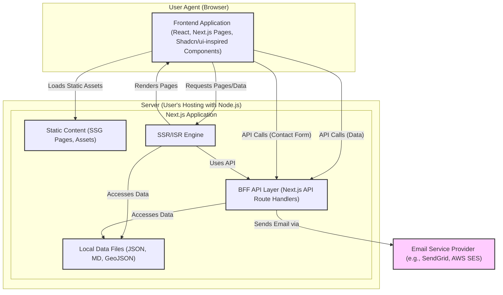

**Component View**

The system is primarily one major component: the Next.js Application. However, for clarity, we can logically divide it into:

1.  **Frontend Application (Client-Side & Server-Side Rendered UI):**

      * **Responsibilities:** Rendering all user-facing pages and components, handling user interactions, managing client-side state, and making requests to the BFF API layer for dynamic data. UI components will be built with a Shadcn/ui-inspired philosophy: creating custom, composable, accessible components from scratch (or unstyled primitives), styled with Tailwind CSS, and developed/documented in Storybook.
      * **Key Modules/Directories (within `src/`):**
          * `app/`: Contains page definitions, layouts, and API route handlers (acting as the BFF).
          * `components/`: Houses all reusable React UI components (layout, maps, inventory, insight, common, animations). This is the primary target for Storybook development.
          * `store/`: Zustand stores for client-side state management (UI state, map state, etc.).
          * `hooks/`: Custom React hooks for reusable logic.
          * `lib/`: Utility functions, GSAP setup, mapping library setup.
          * `services/`: Client-side services for interacting with the BFF API layer.
          * `styles/`: Global styles and Tailwind CSS configuration.
          * `types/`: TypeScript type definitions.
          * `content/`: Local data files for V1 (Markdown, JSON, GeoJSON).

2.  **Backend-For-Frontend (BFF) API Layer (Next.js Route Handlers):**

      * **Responsibilities:** Handling API requests from the frontend, fetching/processing data from V1 data sources (local files), structuring data for frontend consumption, and handling server-side logic like sending emails for contact form submissions.
      * **Location:** Resides within the `src/app/api/` directory of the Next.js application.

<!-- end list -->

**Architectural / Design Patterns Adopted**

  * Monorepo: Single repository for simplified dependency management and streamlined build/deployment processes for V1.
  * Next.js Framework (App Router Paradigm): Leveraged for its comprehensive features including file-system routing, hybrid rendering (SSR, SSG, ISR, CSR), Server Components, Client Components, image optimization, and TypeScript support.
  * React Component-Based Architecture: UI built with reusable React components, promoting modularity and maintainability.
  * Shadcn/ui Inspired Component Build (with Storybook): Focus on creating custom, composable, accessible components from scratch (or unstyled primitives like Radix UI), styled using Tailwind CSS, and developed/documented in Storybook. This provides maximum control and avoids dependency on large, opinionated UI libraries.
  * Tailwind CSS (Utility-First CSS): For rapid UI development, responsive design, and implementing dark/light themes.
  * GSAP (GreenSock Animation Platform): For high-performance, sophisticated UI animations and interactions (e.g., vertical twin scrolling).
  * Zustand (State Management): Lightweight, hook-based state management for global and complex local UI state.
  * Backend-For-Frontend (BFF) via Next.js Route Handlers: API routes within the Next.js app tailored specifically for the frontend's data needs, abstracting direct data source interactions and handling tasks like email sending.
  * Hybrid Rendering Strategy: Strategic use of SSG, SSR, ISR, and CSR to balance performance, SEO, and interactivity.
  * Modular Design (Services, Hooks, Components): Code organized into distinct modules for better separation of concerns and reusability.
  * Facade Pattern: API service modules (`src/services/`) act as facades, simplifying interactions with the BFF API Layer. 